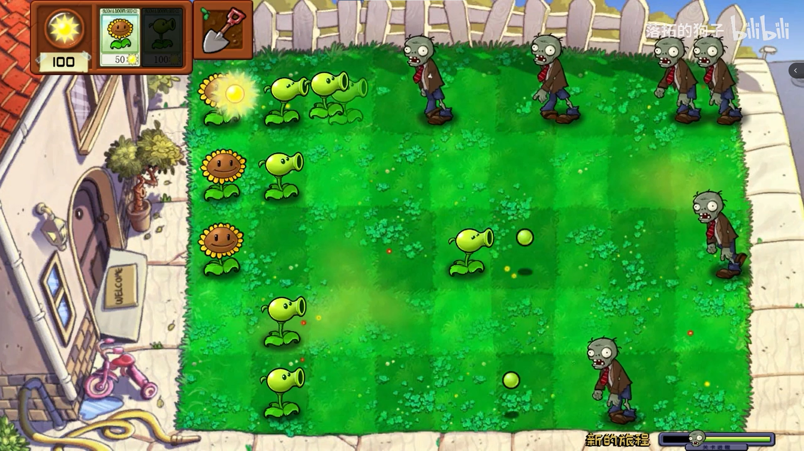
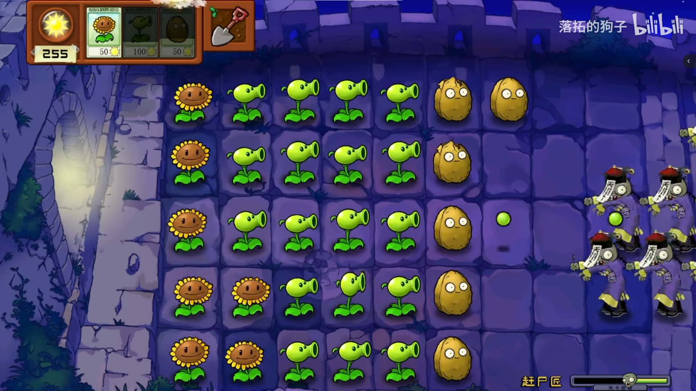
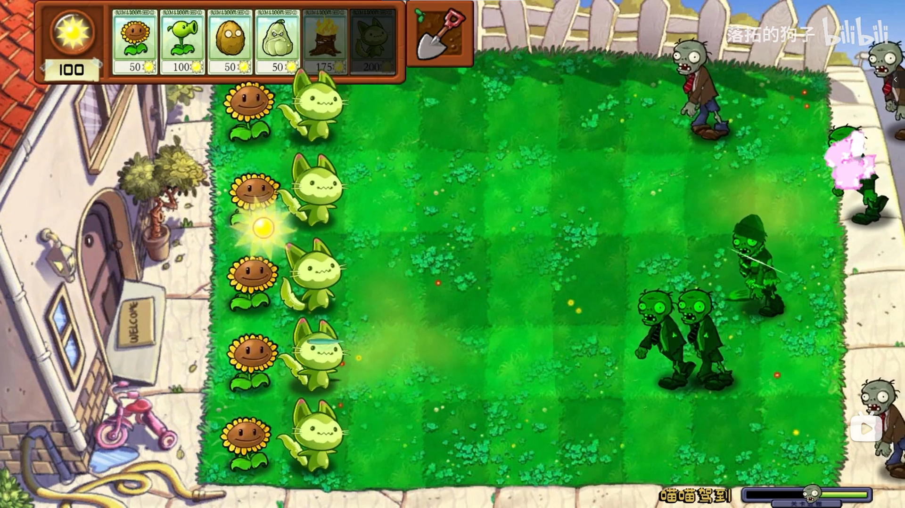

# PvZ-Unity

## Màn Đấu trường Gargantuar

Chọn **Phiêu lưu** ở menu chính để vào màn chơi duy nhất mới. Điều khiển Peashooter bằng **WASD**, **phím mũi tên** hoặc joystick trên màn hình; nhấn **Space**, **Ctrl**, nút A trên tay cầm hoặc nút **BẮN** để bắn theo hướng đang quay.

Gargantuar có 200 máu, mỗi viên đậu gây 20 sát thương. Hạ một Gargantuar được 100 điểm; nếu nó vượt biên trái, nó sẽ trở lại từ biên phải ở vị trí dọc ngẫu nhiên và giữ nguyên lượng máu. Peashooter có ba mạng và điểm cao nhất được lưu giữa các lượt chơi.
Bản dựng lại game Plants vs. Zombies (PvZ) bằng Unity với độ tái hiện cao. Dự án mới hoàn thiện luồng chơi của các màn, chưa dựng lại toàn bộ luồng game của bản gốc. Có bổ sung một số cây, zombie và màn chơi mới do tác giả tự thiết kế; một phần tài nguyên được lấy từ trên mạng.

## Giới thiệu dự án

### Video dự án

Video giới thiệu dự án đã được đăng lên Bilibili, mời ghé trang của tác giả “落拓的狗子” để xem. Một số link video:

【Dave: Không ngờ đúng không, xe đẩy bị tôi trộm mất rồi (PVZ tự làm)】 https://www.bilibili.com/video/BV1U84y1b7i4/?share_source=copy_web&vd_source=c0fb8fd2ce069eb3b7f57c407f2e3a26

【Màn mới: Vùng Đất Bất Tử | Bóng ma lởn vởn khắp nơi, zombie biết hồi sinh】 https://www.bilibili.com/video/BV1C14y1F77b/?share_source=copy_web&vd_source=c0fb8fd2ce069eb3b7f57c407f2e3a26

【Cây mới: Mèo Miu | Rơi nước mắt trong một giây? DNA tuổi thơ của bạn có rung động không】 https://www.bilibili.com/video/BV13k4y1e7bL/?share_source=copy_web&vd_source=c0fb8fd2ce069eb3b7f57c407f2e3a26

### Ảnh chụp màn hình

## Bắt đầu nhanh

- Tải mã nguồn, dùng Unity mở thư mục này như một project.
    - Phiên bản Unity: 6000.5.8f1
- Mở scene game Assets/Scenes/GameScene .
- Chạy project.

## Ghi chú dự án

- Đối tượng Game Management trong scene có component script cùng tên; tham số level của nó dùng để chọn màn chơi sẽ tải, hiện dùng được các giá trị 0 - 4 .
